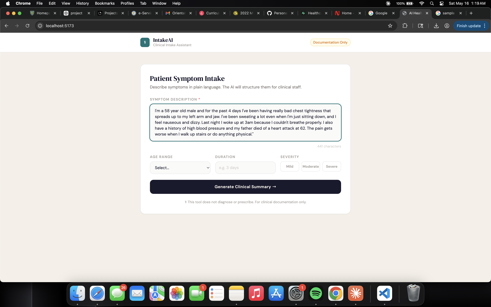
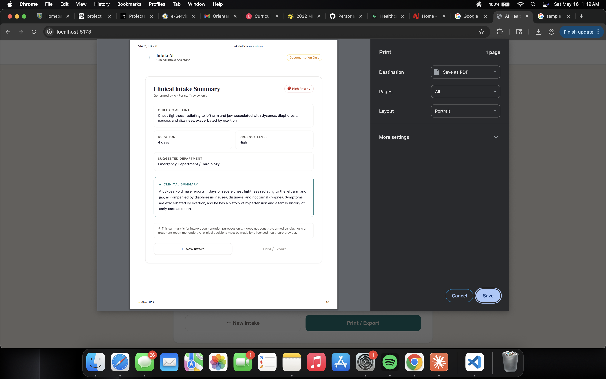
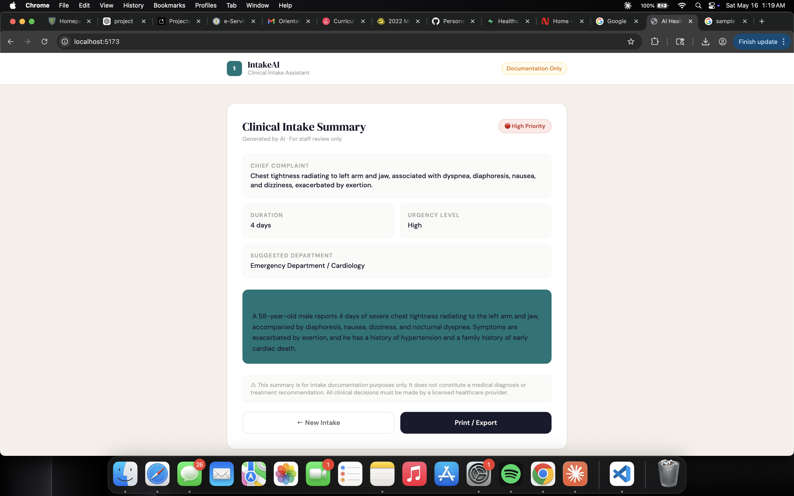

# IntakeAI — AI Healthcare Intake & Clinical Summary Assistant

> An AI-powered intake assistant that converts unstructured patient symptom descriptions into structured clinical summaries for healthcare staff.



---

## ⚠️ Disclaimer

This tool is for **documentation and intake assistance only**. It does **not** diagnose diseases, prescribe treatment, or claim medical certainty. All clinical decisions must be made by a licensed healthcare provider.

---

## 🧠 Overview

Healthcare staff spend significant time manually collecting, interpreting, and documenting patient symptoms during intake. This leads to inconsistent documentation, longer wait times, and provider burnout.

**IntakeAI** solves this by:
- Accepting patient symptom input in plain natural language
- Sending it to Google Gemini AI for structured extraction
- Returning a clean clinical intake summary to healthcare staff in seconds

---

## 📸 Screenshots

### Patient Intake Form


### AI Clinical Summary


### Print / Export View


---

## 🏗️ Architecture

```
Patient (Browser)
    → React Frontend (Vite + Tailwind)
        → POST /analyze
            → FastAPI Backend (Python)
                → Google Gemini 2.5 Flash API
                    ← Structured JSON
                ← { chief_complaint, duration, urgency, department, summary }
            ← Clinical Summary Card
```

---

## 🛠️ Tech Stack

| Layer     | Technology                        |
|-----------|-----------------------------------|
| Frontend  | React 18, TailwindCSS, Vite       |
| Backend   | Python 3.13, FastAPI, uvicorn     |
| AI        | Google Gemini 2.5 Flash           |
| HTTP      | httpx (async)                     |
| Config    | python-dotenv                     |

---

## 🚀 Quick Start

### Prerequisites
- Python 3.10+
- Node.js 18+
- Google Gemini API key → [Get one free](https://aistudio.google.com/apikey)

### 1. Clone the repo
```bash
git clone https://github.com/bbotwe00/ai-health-intake-assistant.git
cd ai-health-intake-assistant
```

### 2. Backend setup
```bash
cd backend
python3 -m venv venv
source venv/bin/activate
pip install fastapi uvicorn httpx python-dotenv "pydantic>=2.7" certifi --only-binary=:all:

cp .env.example .env
# Edit .env and add your GEMINI_API_KEY

python3 -m uvicorn main:app --reload --port 8000
```

### 3. Frontend setup
```bash
cd frontend
npm install
npm run dev
```

Open **http://localhost:5173** in your browser.

---

## 📡 API Reference

### `POST /analyze`

**Request:**
```json
{
  "symptoms": "I've had chest pain and shortness of breath for 2 days.",
  "age_range": "40-50",
  "duration": "2 days",
  "severity": "moderate"
}
```

**Response:**
```json
{
  "result": {
    "chief_complaint": "Chest pain and shortness of breath",
    "duration": "2 days",
    "urgency": "High",
    "suggested_department": "Emergency Department / Cardiology",
    "summary": "Patient reports chest pain and difficulty breathing persisting for 2 days, exacerbated by physical exertion."
  }
}
```

Interactive API docs: `http://localhost:8000/docs`

---

## 🤖 AI Safety Constraints

The Gemini prompt is explicitly constrained to:
- ✅ Extract and structure symptom information
- ✅ Classify urgency (Low / Medium / High)
- ✅ Suggest relevant departments
- ❌ Never diagnose diseases
- ❌ Never recommend treatment or medication
- ❌ Never claim medical certainty

---

## 📁 Project Structure

```
ai-health-intake-assistant/
├── backend/
│   ├── main.py
│   ├── ai_service.py
│   ├── requirements.txt
│   └── .env.example
├── frontend/
│   ├── src/
│   │   ├── App.jsx
│   │   ├── components/
│   │   │   ├── SymptomForm.jsx
│   │   │   └── IntakeSummary.jsx
│   │   └── main.jsx
│   └── index.html
├── docs/
│   ├── screenshots/
│   ├── architecture.md
│   └── development-log.md
└── README.md
```

---

## 🔮 Roadmap

- **Phase 2**: Voice-to-text intake, multilingual support, severity scoring
- **Phase 3**: EHR integration (FHIR), appointment scheduling, insurance pre-check

---

## 👤 Author

Built by [@bbotwe00](https://github.com/bbotwe00)
